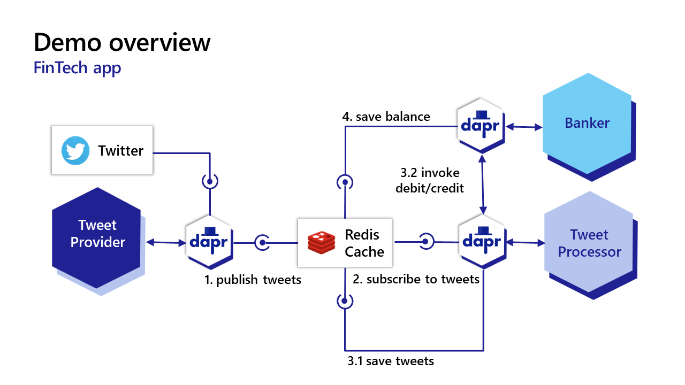
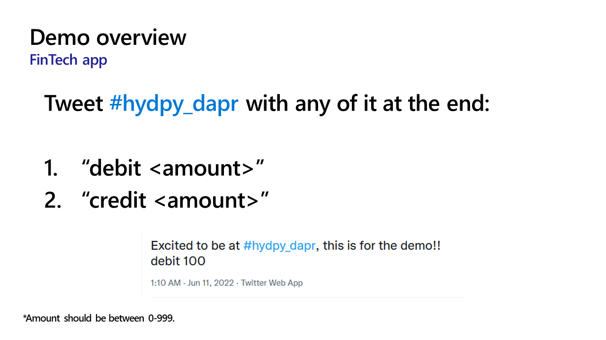

# Demo

This respository contains the source code for my demo at HydPy.

## Architecture




## Running it locally

```bash
dapr run --app-id banker --app-port 50050 --app-protocol grpc --log-level info --components-path ./components/ python3 services/banker/app.py

dapr run --app-id tweet-processor --app-port 50051 --app-protocol grpc --log-level info --components-path ./components/ python3 services/tweet-processor/app.py

dapr run --app-id tweet-provider --app-port 50052 --app-protocol grpc --log-level info --components-path ./components/ python3 services/tweet-provider/app.py
 ```